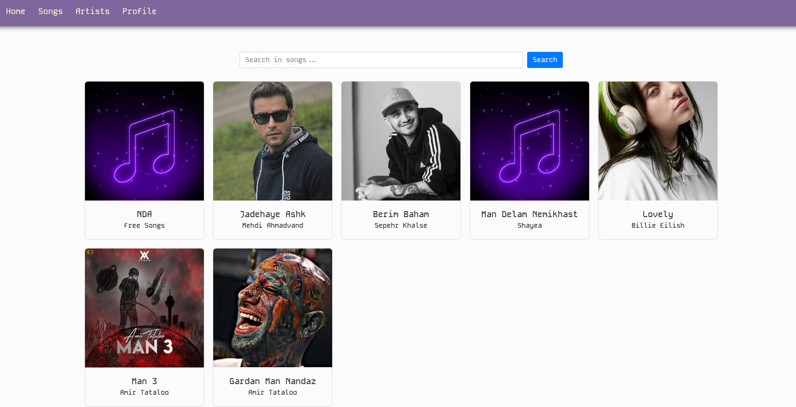
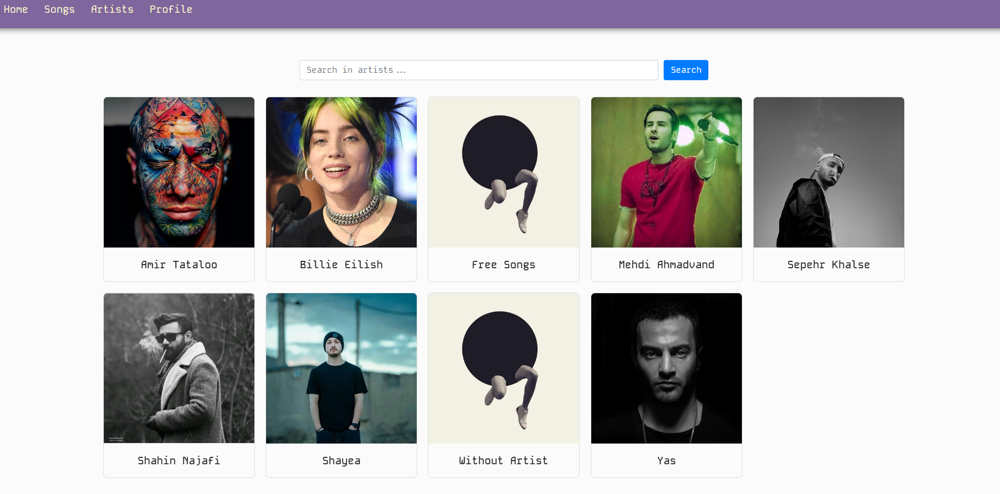
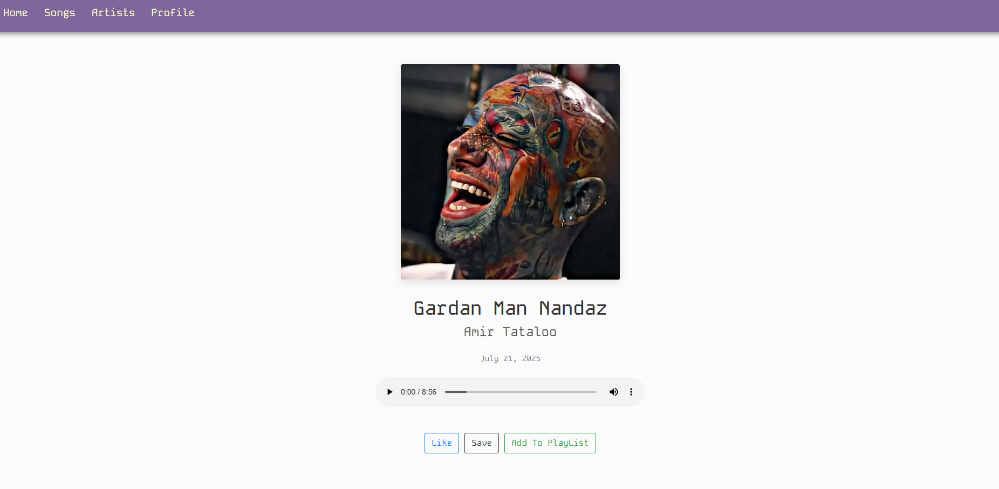
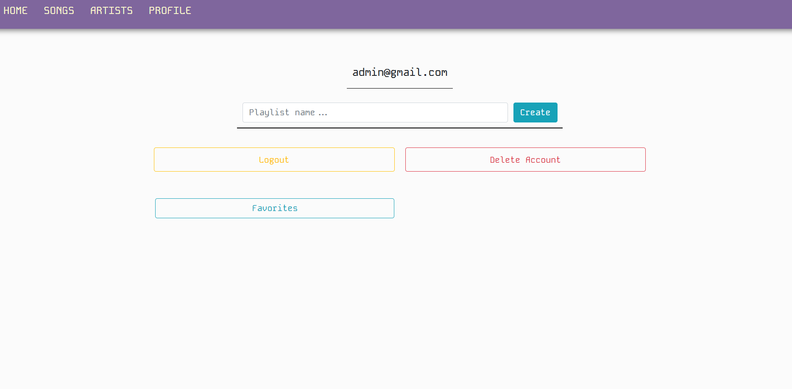

# Installing
### Run the following command:
    pip install -r requirements.txt

    python manage.py migrate
    
    python manage.py runserver

### Open browser and go to this address:

    localhost:8000

### Use the admin panel to manege the app:
    python manage.py createsuperuser

    python manage.py migrate

    python manage.py runserver

# GitHub OAuth Setup:
### Go to GitHub Developer Settings

> Click "New OAuth App"

> Fill in the details:

> Application name: Your App Name

> Homepage URL: http://localhost:8000

> Authorization callback URL: http://localhost:8000/oauth/complete/github/

> Click "Register application"

> Copy the Client ID and generate a Client Secret

> In your settings.py, add:

```python
SOCIAL_AUTH_GITHUB_KEY = 'your-client-id'
SOCIAL_AUTH_GITHUB_SECRET = 'your-client-secret'
```

#




